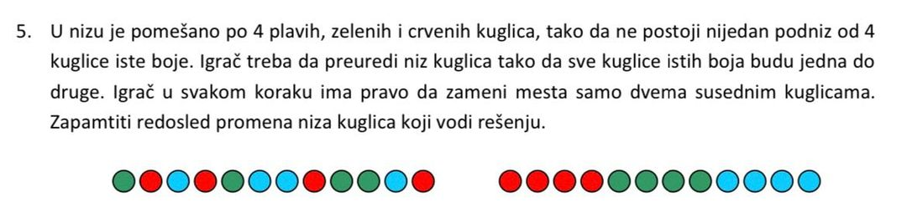

## Problem


(translate from Serbian)

Sort balls of different colors (4 of each type) by swapping places of two neighbours per move.

Implementation of A\* search algorithm for AI purposes.

## Installation

```bash
$ yarn install
```

## Running the app

```bash
# development
$ yarn dev gbrgbbrggbrr
```

## Test

```bash
# unit tests
$ npm run test
```
